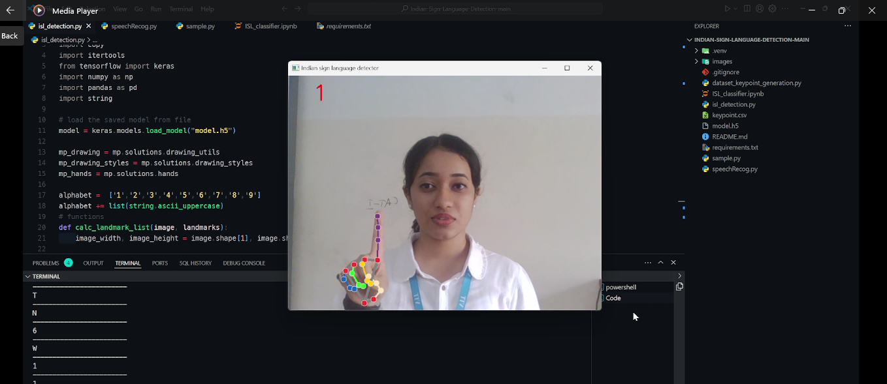
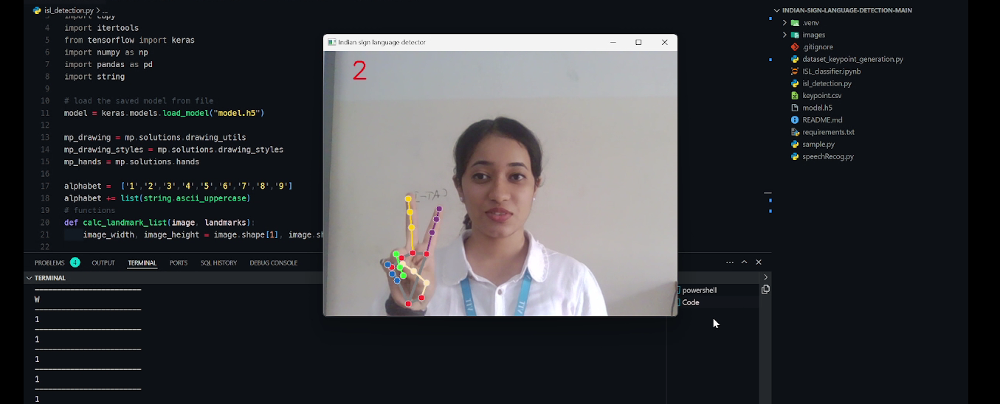
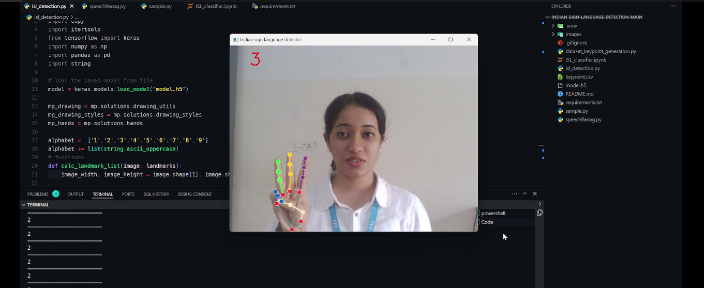
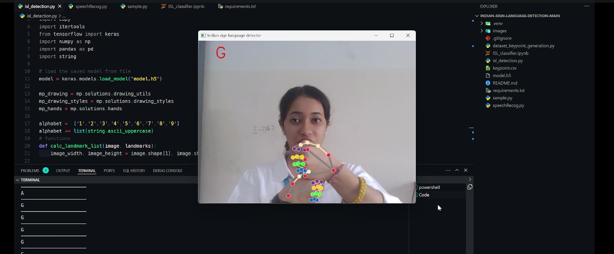
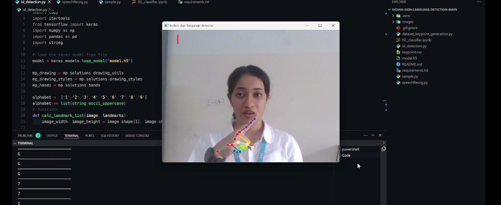
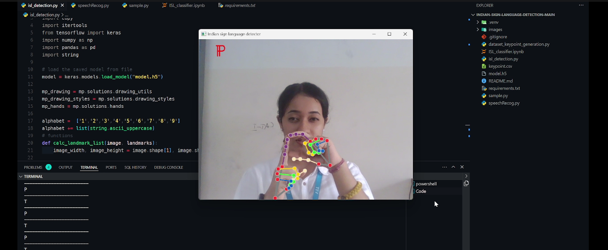

# Indian Sign Language Detection

This project aims to detect and recognize Indian Sign Language (ISL) gestures using the Mediapipe library. The project is implemented in Python.

## Requirements

To run this project, you will need the following dependencies:

-   Python 3.6 or higher
-   Mediapipe library
-   OpenCV library
-   Numpy library

## Installation

1. Install Python 3.6 or higher on your system.

2. Install the Mediapipe library using the following command:

    ```bash
    pip install mediapipe
    ```

3. Install the OpenCV library using the following command:

    ```bash
    pip install opencv-python
    ```

4. Install the Numpy library using the following command:
    ```bash
    pip install numpy
    ```

## Usage

Run the following command to start the program:

```bash
python main.py
```

-   The program will start and display the video stream from the webcam.
-   To exit the program, press the 'q' key.

## How It Works

The program uses the Mediapipe library to detect landmarks on the user's hand and fingers in real-time. These landmarks are then fed into a feedforward neural network (FNN) that was trained on an Indian Sign Language (ISL) dataset from Kaggle. The FNN predicts the class of the hand gesture based on the detected landmarks.

During execution, the program:

1. Captures video frames using the webcam.
2. Applies the Mediapipe hand detection model to detect hands in each frame.
3. Extracts hand landmarks from the detected hands.
4. Passes the landmarks to the classification model, which predicts the class of the hand gesture.
5. Displays the predicted class on the video stream in real-time.

## Example Output







