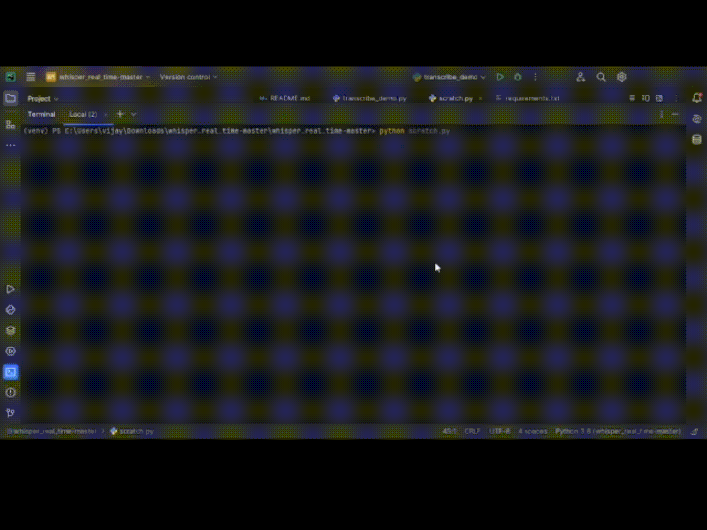

# Indian Sign Language Detection

An innovative AI powered applications that bridges the gap between hearing and speech impaired community and the rest of India

## Requirements

To run this project, you will need the following dependencies:

-   Python 3.6 or higher
-   Mediapipe library
-   OpenCV library
-   Numpy library

## Installation

1. Install Python 3.6 or higher on your system.

2. Install the required library

## Example Output

### ISL to text

### Text to ISL

### Speech Recognition

